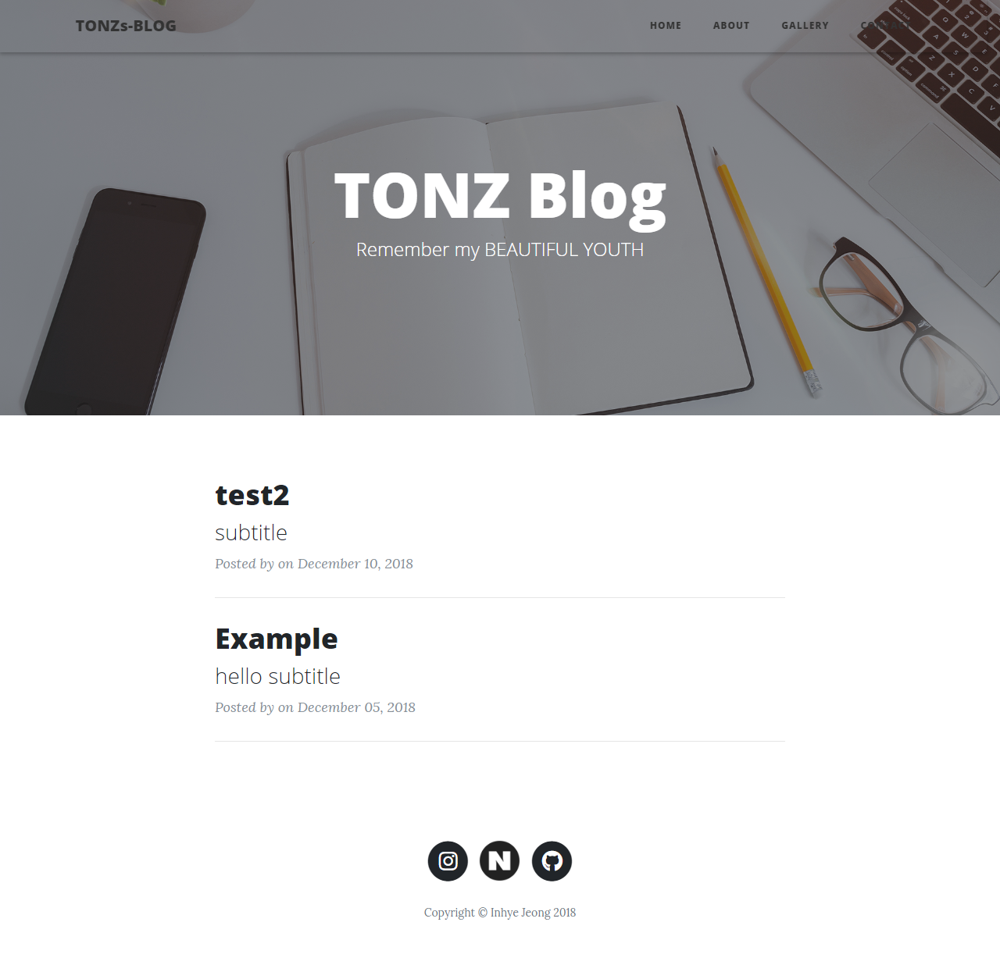
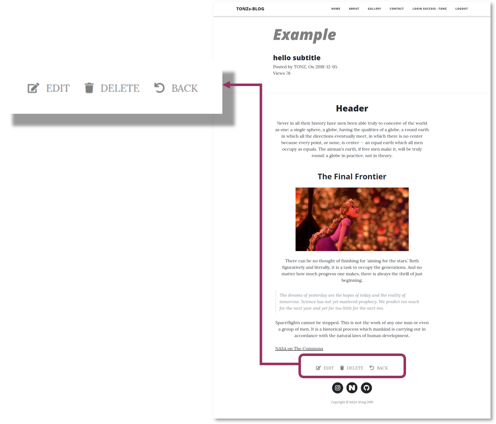
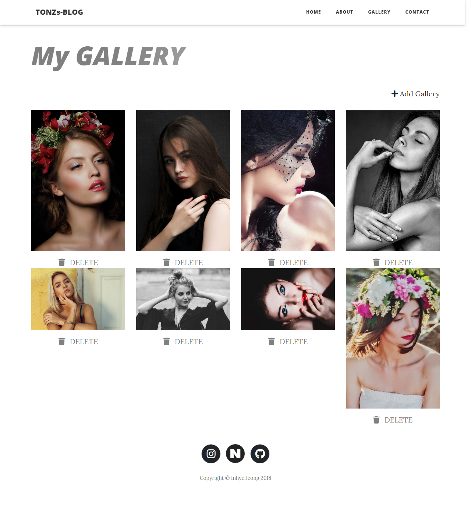
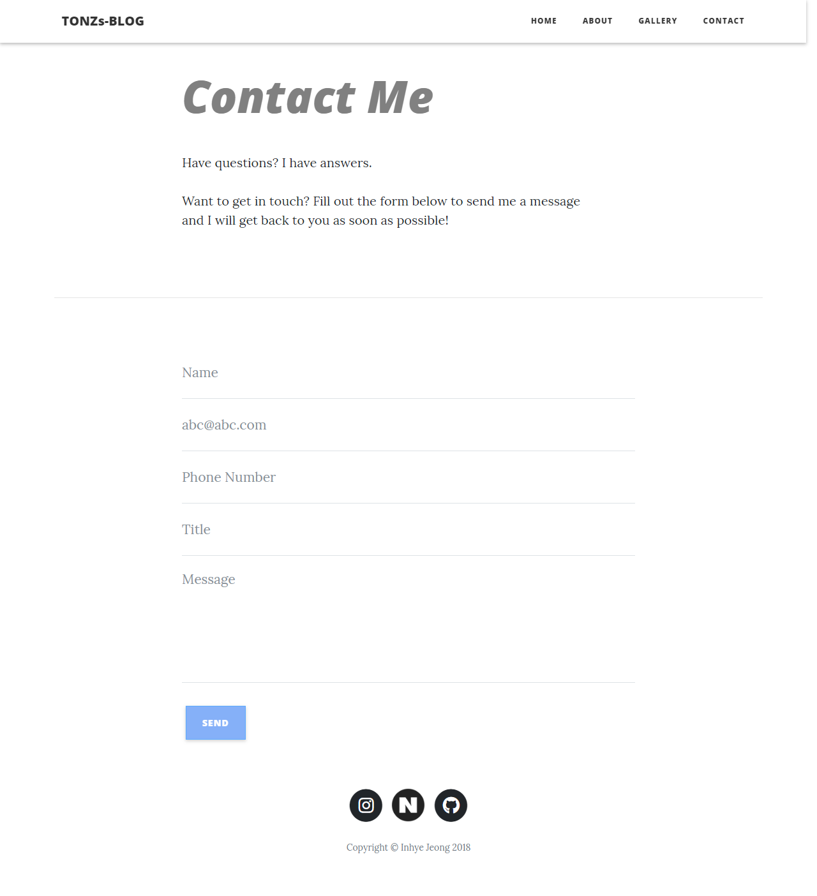

# [**MyBlog**](http://13.209.26.216:8080/travelhelper/)


Spring MVC 패턴으로 만든 개인 블로그 반응형 웹사이트 입니다.

* 2018년 11월 ~ (진행중)
*  이 프로젝트의 **Tech Stack**
```dart
jQuery / javascript / java / lombok / css3 /
html5 / oracle / tomcat8.5 / Spring / MDBootstrap /
Mybatis / JDBC / json / tinymce / Ajax
```


* [**MyBlog Link**](http://13.209.26.216:8080/travelhelper/)
<p align="center">
	
</p>


<br>


## 메뉴별 기능 소개

### 1. Home
<p align="center">
	
</p>

- 메인화면에 게시물 리스트 구현
- 게시물 업로드 및 **삭제(Ajax)** (ADMIN 계정만 사용가능)
- TinyMce를 활용하여 글 및 [사진업로드](./MyBlog/src/main/webapp/WEB-INF/views/create.jsp) 가능
- 각 게시물 별 조회수 기록

### 1-1. LogIn (ADMIN 계정만 사용가능)

- 로그인 기능(개인 운영용이기 때문에 db로 아이디 등록, 비밀번호 **암호화**) 
- 로그인 인터셉터 (메인화면의 posting, gallery의 Addgallery)

### 2. About

- 자기소개 페이지

### 3. Gallery
<p align="center">
	
</p>

- 사진 업로드 (ADMIN 계정만 사용가능)
- **삭제(Ajax)** 기능 (ADMIN 계정만 사용가능)
- LightBox를 활용하여 사진 뷰
- 업로드 순서대로 **정렬**

### 4. Contact

<p align="center">
	
</p>

* 방문자가 이름, 연락처, 이메일, 내용을 작성하면 **연동된 ADMIN 이메일**로 전송되는 기능


<br>

## 사용된 기술

#### 사용자 정의 뷰 사용

* Gallery 메뉴에서 Lightbox **이미지 출력**에 [사용자 정의 뷰(FileView)](./MyBlog/src/main/java/edu/iot/myblog/view)를 사용했습니다.

```dart
@Component("fileView")
public class FileView extends AbstractView {

	@Override
	protected void renderMergedOutputModel(
			Map<String, Object> model,
			HttpServletRequest request,
			HttpServletResponse response) throws Exception {
		
		String path = (String) model.get("path");
		String type = (String) model.get("type");
		
		File file = new File(path);
		
		// Header Setting
		response.setContentType(type);
		response.setContentLength((int) file.length());
		response.setHeader("Content-Transfer-Encoding", "binary");
		
		// Apache Commons IO
		FileUtils.copyFile(file, response.getOutputStream());
	}
	
}
```
  
#### Ajax
* 게시물 삭제 Ajax 처리
자세한 내용은 Home메뉴의 [view.jsp](./MyBlog/src/main/webapp/WEB-INF/views/view.jsp) 및 Gallery메뉴의 [list.jsp](./MyBlog/src/main/webapp/WEB-INF/views/gallery/list.jsp)폴더에 있습니다.
```dart
	$(function() {
		//	삭제눌렀을때 alert
		$('.delete-btn').click(function(e) {
			e.preventDefault();
			//	this는 클릭된 a태그(삭제버튼)
			var imageId = $(this).data('target');
			var result = confirm("사진을 삭제할까요? ");

			if (!result) return;

			var url = '../gallery/delete';
			var params = {
				imageId : imageId
			};

			/**Ajax 호출*/
			$.get(url, params, function(result) {
				if (result == 'delete') {
					//어디로 어떻게 이동?:javascript로 페이지 이동 location
					location = '../gallery/list';
				} else {
					alert('삭제 실패 : ' + result);
				}
			});
		});
	});
```
* [MyGalleryController](./MyBlog/src/main/java/edu/iot/myblog/controller/MyGalleryController.java)

```dart
	:
	:
	@ResponseBody
	@RequestMapping(value="delete",
					method=RequestMethod.GET,
					produces = "text/plain; charset=utf8")
	public String delete(MyGalleryImage mgallery) {
		log.warn("delete 컨트롤러 실행됨");
		try {
			service.delete(mgallery);
			return "delete";
		} catch (Exception e) {
			return e.getMessage();
		}
	}
}
```
